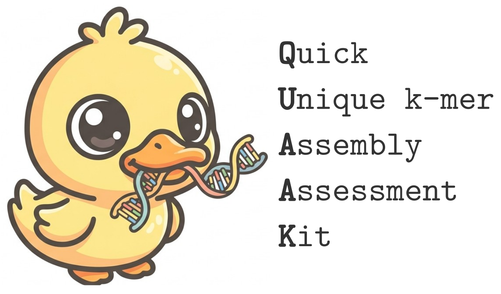

# QUAAK



## Contents

1. [Introduction](#1-introduction)
2. [Installation](#2-installation)
3. [Usage](#3-usage)
4. [Example](#4-example)
5. [Limitations](#5-limitations)
6. [License](#6-license)

## 1. Introduction

QUAAK is a unique-k-mer based assembly assessment tool. 
It extends the idea of single-copy genes to unique k-mers to evaluate the assembly completeness.
Naturally, with paired unique k-mers between reference and query genome, synteny blocks can be constructed to identify large structural variations and assembly errors.
Limited by the k-mer construction process, QUAAK can only be applied to human assembly for now.


Cite: TBD

[↑ back to top](#contents)

## 2. Installation

### Requirements

- `bash` (4.4+ recommended, for `inherit_errexit`)
- `getopt` (the enhanced GNU version)
- A C99 compiler (e.g. `gcc`) and `zlib`/`libm` — to build the C utilities
- `python3` with `numpy` and `matplotlib`
- Standard tools: `gzip`, `zcat`, `zgrep`

### Build the C utilities

The two C helpers (`kmer-map`, `kmer-block`) must be compiled before use:

```bash
cd src/kmer-C-ult
make
```

This produces `kmer-map` and `kmer-block` in `src/kmer-C-ult/`, where
`quaak.sh` expects to find them. No further installation step is required — run
the driver in place.

[↑ back to top](#contents)

## 3. Usage

```
bash src/quaak.sh [OPTIONS] value
```

| Option | Required | Default | Description |
|---|---|---|---|
| `-k`, `--kmer <string>` | conditionally | — | Reference k-mer set (`.fa`, `.fa.gz`). Required if `-r` or `-q` is given as FASTA. |
| `-r`, `--reference <string>` | yes | — | Reference assembly (`.fa`, `.fa.gz`, or precomputed `.path` / `.path.gz`). |
| `-q`, `--query <string>` | yes | — | Query assembly (`.fa`, `.fa.gz`, or precomputed `.path` / `.path.gz`). |
| `-o`, `--out <string>` | no | `./output` | Output prefix. |
| `--cytobands <string>` | no | — | Cytoband BED file for plot annotation. |
| `--blockcut <int,int>` | no | `500000,10000` | `distance,diff`: max distance between consecutive k-mers, and max gap-size difference of a k-mer pair between reference and query. |
| `--taucut <float>` | no | `0.9` | `abs(tau)` cutoff for selecting contigs with a confident strand direction. |
| `--svcut <int,int>` | no | `500000,100` | `length,kmer_count`: cutoffs for reporting large SVs and assembly errors. |

**Notes**

- Both `-r/--reference` and `-q/--query` are required.
- `-k/--kmer` is required whenever the reference or query is supplied as FASTA
  (it is used to generate the corresponding path file). If both inputs are
  already path files, `-k` is not needed.
- Re-using a precomputed reference path file (`OUT.ref.path.gz`) is ~2× faster, since path generation is skipped.
- The output directory (the directory part of `-o`) must already exist and be
  writable.

### Key output files (with prefix `OUT`)

- `OUT.ref.path.gz`, `OUT.que.path.gz` — generated path files (FASTA input only). They can be re-used as inputs for SV discovery with further fine-tuning parameters. The path file is generated by [kmer-map](https://github.com/lh3/kmer-map), developed by Heng Li. The path file has six columns, follows as contig name, start, end, k-mer id, k-mer length, k-mer strand.

- `OUT.block.tsv.gz` — synteny blocks generated by 'kmer-block', the output has 10 columns, follows as query contig name, block index, que_start, que_end, ref_contig, ref_start, ref_end, k-mers on the positive strand, k-mers on the negative strand, boundary k-mer names. 

- `OUT.ctg-strand.tsv` — per-contig strand / Kendall's tau summary. It has ten columns, follows as query contig name, que_start, que_end, ref_contig, ref_start, ref_end, tau_coef, tau_p-value, number of positive strand k-mers, number of negative strand k-mers. This file is used to select contig with confident strand regarding the reference genome.

- `OUT.conf-ctgs.txt`, `OUT.suspect-ctgs.txt`, `OUT.sel-ctgs.txt`, `Out.rescue-ctgs.txt` — contig selection. `OUT.conf-ctgs.txt` records contig with abs(tau) above 0.9, `OUT.suspect-ctgs.txt` records contig with abs(tau) bellow 0.9, `OUT.rescue-ctgs.txt` is an empty file created by QUAAK and user can add any contigs with manually determined strand. `OUT.sel-ctgs.txt` is all contigs that used in SV calling.

- `OUT.annot.tsv.gz` — SV-annotated blocks. It has ten columns, follows as query contig name, que_start, que_end, ref_contig, ref_start, ref_end, ref_start2, ref_end2, k-mer numbers, annotation. ref_start2 and ref_end2 are outer boundaries for the block, used for define complex structural variations.

- `OUT.summary.txt` — brief text report

- `OUT.allref.pdf`, `OUT.allctg.pdf`, `OUT.sel-sv.pdf`, `OUT.suspect-block.pdf` — plots

[↑ back to top](#contents)

## 4. Example

Data preparing:

Download AGC file (human579.agc) from https://github.com/lh3/OpenHGL .

Make sure the tool [agc](https://github.com/refresh-bio/agc) is installed.

Extract reference genome and query genome

```bash
agc getset 100000_CHM13.pri human579.agc | gzip -c > ref.fa.gz
agc getset 200001_HG002.pat human579.agc | gzip -c > query.fa.gz
```

Download the reference unique k-mer set (`sel-500.kmer.fa.gz`) from https://zenodo.org/records/20535064 and save as 'ref.kmer.fa.gz'.


Run directly from FASTA:

```bash
bash src/quaak.sh -k ref.kmer.fa.gz -r ref.fa.gz -q query.fa.gz -o test.out
```

Compute the path files from fasta file

```bash
src/kmer-C-ult/kmer-map ref.kmer.fa.gz ref.fa.gz | gzip -c > ref.path.gz
src/kmer-C-ult/kmer-map ref.kmer.fa.gz query.fa.gz | gzip -c > query.path.gz
```

Compute the path files from agc file

```bash
agc getset 100000_CHM13.pri human579.agc \
  | src/kmer-C-ult/kmer-map ref.kmer.fa.gz - | gzip -c > ref.path.gz
agc getset 200001_HG002.pat human579.agc \
  | src/kmer-C-ult/kmer-map ref.kmer.fa.gz - | gzip -c > query.path.gz
```


Run from precomputed path files:

```bash
bash src/quaak.sh -r ref.path.gz -q query.path.gz -o test.out
```


Run from precomputed ref path file and query FASTA files:

```bash
bash src/quaak.sh -k ref.kmer.fa.gz -r ref.path.gz -q query.fa.gz -o test.out
```

With optional tuning and cytoband annotation:

```bash
bash src/quaak.sh \
  -k ref.kmer.fa.gz -r ref.fa.gz -q query.fa.gz \
  -o test.out \
  --blockcut 500000,10000 \
  --taucut 0.9 \
  --svcut 500000,100 \
  --cytobands src/block-panel-plot/chm13v2.0_cytobands_allchrs.bed
```

**Notes** :

1. for large population cohort, we suggest to generate path file first and use path file as input for further analyses.
2. cytobands files are in src/block-panel-plot, the contig name should be consistent between the cytobands and reference genome.
3. `src/block-panel-plot` includes some visualization tools in python, check 'src/quaak.sh' for usage examples or use AI tools for help.

[↑ back to top](#contents)

## 5. Limitations

- **Human assemblies only.** The bundled unique k-mer set is built for the
  human genome; other species are not currently supported.
- **Uncovered regions.** SVs in immunoglobulin (IG), repeated/duplicated, and low complexity regions are not covered due to lack of k-mers.

[↑ back to top](#contents)

## 6. License

Released under the [MIT License](LICENSE).

[↑ back to top](#contents)
